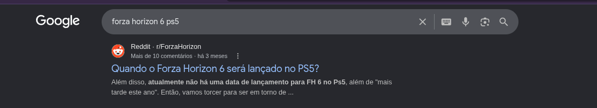
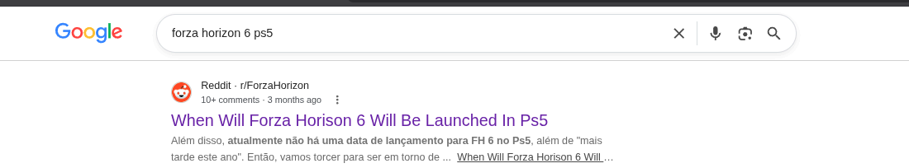

# Google Untranslate Search Results

A lightweight Google Chrome extension that prevents Google Search from forcing translated search results, restoring original page titles and clean URLs.

## The Problem

When searching for content (especially in English or other non-native languages), Google Search frequently forces a "Translated Results" feature. It automatically rewrites the page titles in your search results to your native language. Furthermore, when clicking these results, Google appends the `tl` parameter (such as `?tl=pt-br`) to the destination URL, forcing the external website (like Reddit, Stack Overflow, or Wikipedia) to load via Google Translate rather than displaying the original content. 

This extension intercepts these links directly on the Google Search Results page, strips the translation parameters, and reconstructs the original, non-translated titles from the target URL's slug.

## Features

* **Real-time URL Cleansing:** Instantly strips `tl` and `sl` translation parameters from search result links.
* **Original Title Restoration:** Parses friendly URLs (slugs) for popular platforms (Reddit, Stack Overflow, GitHub, Wikipedia, Medium, Quora) and generic websites to restore the original, non-translated title on the search page.
* **Bypass Google Tracking Redirects:** Removes Google's click-intercept attributes (`data-jsarwt`, `data-usg`, `data-ved`), forcing direct navigation to the original source.
* **No Background Overhead:** Uses a mutation observer directly in the search page, keeping your browser fast and light.

---
## Visual Comparison

| Before (Forced Translation) | After (Restored Original) |
| :---: | :---: |
|  |  |

---

### Prerequisites

Clone this repository or download the source code as a ZIP file and extract it.

```bash
git clone https://github.com/bragus/remove-google-tl.git

```
## Installation

Since this is an open-source tool and not hosted on the Chrome Web Store, you can easily load it into any Chromium-based browser (such as Google Chrome, Brave, Opera, Microsoft Edge, or Vivaldi) using Developer Mode.

### 2. Load the Extension into Your Browser

Follow the instructions below depending on the browser you are using:

#### Google Chrome / Chromium
1. Open Chrome and navigate to `chrome://extensions/`.
2. In the top-right corner, toggle the **Developer mode** switch to **ON**.
3. In the top-left corner, click the **Load unpacked** button.
4. Select the folder where you cloned/extracted the project files (the directory containing `manifest.json`).

#### Brave
1. Open Brave and navigate to `brave://extensions/`.
2. In the top-right corner, toggle the **Developer mode** switch to **ON**.
3. Click **Load unpacked** in the top-left menu.
4. Select the project folder.

#### Opera
1. Open Opera and navigate to `opera://extensions`.
2. In the top-right corner, enable the **Developer mode** toggle.
3. Click **Load unpacked** on the top menu.
4. Select the project folder.

#### Microsoft Edge
1. Open Edge and navigate to `edge://extensions/`.
2. In the bottom-left sidebar, turn on the **Developer mode** toggle.
3. Click **Load unpacked** at the top of the page.
4. Select the project folder.

---

### 3. Verification

Once loaded, the extension will run instantly. To verify:

1. Perform a Google search for a query in English (e.g., `Forza Horizon 6 ps5 launch date`).
2. Hover over a Reddit, Stack Overflow, or Wikipedia result.
3. Look at the link preview in the bottom-left corner of your browser. The `tl` parameter should be completely stripped, and the title should automatically display in its original language.